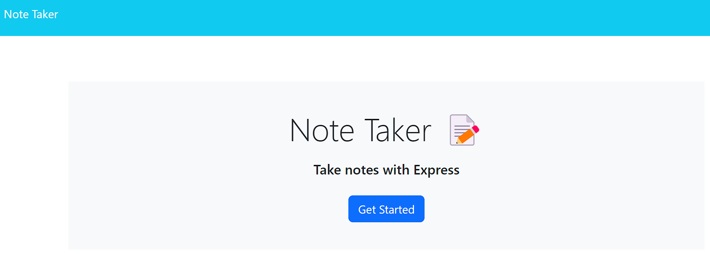

# < NoteTaker>

## Description

When I open the Note Taker
Then I am presented with a landing page with a link to a notes page
When I click on the link to the notes page
Then I am presented with a page with existing notes listed in the left-hand column, plus empty fields to enter a new note title and the note’s text in the right-hand column
When I enter a new note title and the note’s text
Then a Save icon appears in the navigation at the top of the page
When I click on the Save icon
Then the new note I have entered is saved and appears in the left-hand column with the other existing notes
When I click on an existing note in the list in the left-hand column
Then that note appears in the right-hand column
When I click on the Write icon in the navigation at the top of the page
Then I am presented with empty fields to enter a new note title and the note’s text in the right-hand column

## Table of Contents

- [Installation](#installation)
- [Usage](#usage)
- [Credits](#credits)
- [License](#license)
- [Features](#features)
- [How to Contribute](#how-to-contribute)
- [Tests](#tests)

## Installation

N/A

## Usage

Here is the link: https://note-taker-gr-ffecd61993b8.herokuapp.com/

## Credits

Giselle Reyes

## License

## Features

Website

## How to Contribute

Personal challenge

## Tests

Used VS Code